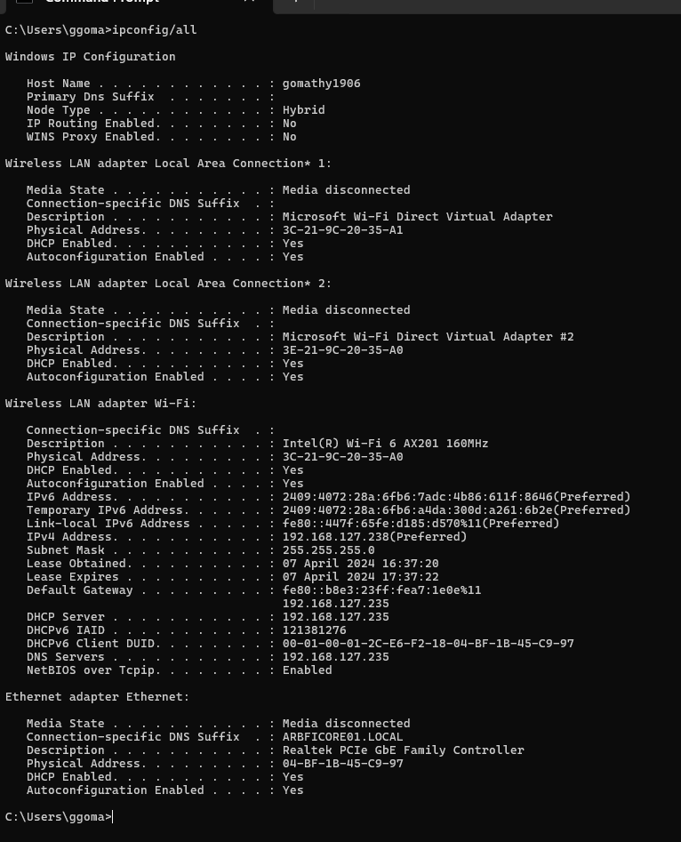

# Ex.01 BASIC NETWORKING COMMANDS
## date:05/04/2024
## AIM
  To understand the working of basic commands in networking.

## COMMANDS
### ipconfig
    Finds the IP address and default gateway.
    
### ipconfig/all
    Displays more information about the network setup on your systems including the MAC address.

### getmac
    Displays physical or MAC address.

### hostname
    Displays the hostname of your machine.
    
### nslookup
    Query name servers for information about various hosts and domains, or to print a list of the hosts in a domain.
    
### tracert
    Reports the IP address of the near-side interface of the routers.

### ping
    Tests the reachability of a device on a network. 

### netstat
    Displays information about tcp and udp connections and ports.

## OUTPUT
<<<<<<< HEAD
 

=======

>>>>>>> 7b911c65e519f4bcf8c28afe4172c8430e8fa8f6
## RESULT
  The basic commands in networking are executed successfully.
